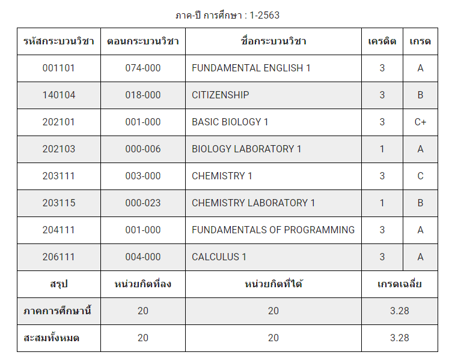
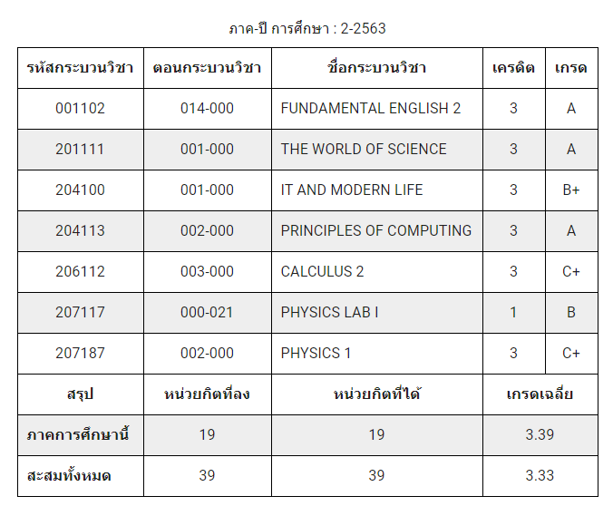

# First year review!

สวัสดีครับ ผมนิก พลกฤต ภารสงัด 630510590 CS CMU 63 ครับ  
ในบทความนี้ผมจะมารีวิวการเรียน, หลักสูตรวิทยาคอม มช 63 ปี 1 แบบคนชิล ๆ สุด ๆ แบบไม่มีใครชิลกว่านี้แล้วครับ  
สำหรับอาจารย์ 204 รับผมไปเป็น TA เถอะครับ หาตังทำคีย์บอร์ดอยู่ :pray:

โดยรูปแบบของเนื้อหาในนี้จะจัดเป็น: รายวิชา การให้คะแนน และประสบการณ์ในวิชานั้น ๆ นะครับ

## เทอม 1

ในช่วงการเรียนเทอมนี้ ตอนครึ่งเทอมแรกก็จะเป็นช่วงโควิด (Covid-19) ระบาดช่วงท้าย ๆ ของระลอกที่ 1
ซึ่งส่วนใหญ่จะเป็นการเรียนแบบสลับกัน คือเรียนในห้องสลับกับออนไลน์ บางวิชาก็ให้เข้าห้องก็ได้ ออนไลน์ก็ได้แล้วแต่นักศึกษา ซึ่งในการเรียนออนไลน์
อาจารย์จะจัดสอนหรือให้งานผ่านทาง Microsoft Team หรือจะใช้เว็บของ มช เองครับ

สำหรับการเรียน บางวิชาจะมีเช็คชื่อ แล้วก็สำหรับการแต่งกายในการเข้าเรียน อาจารย์เค้าไม่ได้บังคับนะครับว่าจะแต่งชุด นศ. หรือชุดสุภาพ
แต่บางวิชาบังคับ และสำหรับเทอม 1 ด้วยความที่เราเป็นเด็กใหม่

สำหรับผมนะ ผมใส่ชุดนศไปทุกคาบเลย แค่เทอม 1 แหละ เดี๋ยวเทอม 2 ค่อยดูกันอีกทีข้างล่าง และเรื่องการสอบของมหาวิทยาลัยในเทอมนี้
จะมีบางวิชาที่สอบออนไลน์ แค่บางวิชานะ นอกนั้นในห้องหมด

เดี๋ยววิชาไหนที่สอบออนไลน์ผมจะบอกเอง ส่วนอันไหนที่ไม่บอกจะไม่เขียนนะครับ และก็เวลาสอบในห้องอะ มันคืออารมณ์แบบสอบพวก Gat-Pat O-Net ไรประมาณนั้นเลย
ไม่ใช่เนื้อหานะ อารมณ์เฉย ๆ แบบว่าเราต้องหาห้องเองอะไรประมาณนี้

## สถานการณ์ที่เกิดขึ้นในเทอมนี้ (Environment Set-up)

เป็นช่วงปลาย ๆ ของโควิดระลอก 1 (ต้นเทอม) แล้วก็มชมีมาตราการลดผ่อนการป้องกันโควิด (หลังกลางเทอม)  
โอเคเข้าเรื่อง ต่อไปนี้จะเป็นการรีวิวแต่ละตัวที่เรียนไปในเทอมนี้นะครับ โดยจะมีเกณฑ์คะแนนความชิลของผมเองในแต่ละวิชาครับ

### 202101 Basic Biology 1

ผมเรียนอยู่ SEC 001 09.30 - 11.00 น. จันทร์กับพฤหัสบดี  
วิชานี้จะเรียนเนื้อหาชีวะ ม.ปลาย + เนื้อหามหาลัยนิด ๆ นิด ๆ จริง ๆ ซึ่งแต่ละคาบก็จะเรียนคาบละเรื่องเลย หรือบางเรื่องใช้ 2 คาบ ตอนผมพึ่งเข้ามาเรียนก็จะมีช่วงปรับตัว ช่วงนั้นคือแบบเหวอมาก ๆ
แบบว่า เชี่ยยย คาบละเรื่องเลยหรอวะ อะไรทำนองนี้ซึ่งในแต่ละเรื่องก็จะใช้อาจารย์มาสอนไม่ซ้ำกัน

**สำหรับการเก็บคะแนน:**

- แบบทดสอบเล็ก ๆ 15% แบ่งเป็น 3% + 4% \* 3 ซึ่งจะเป็นสอบเนื้อหาที่เรียนไปซัก 2 - 3
  คาบที่ผ่านมา
- สอบเก็บคะแนนย่อย 2 ครั้ง ครั้งแรกก่อนกลางภาค 15% ครั้งที่สอง 16% ก่อนปลายภาค
- สอบกลางภาค 28%
- ปลายภาค 26%

แต่เดี๋ยวก่อน มันมีเหตุการณ์ที่เกิดขึ้นจนทำให้คะแนนที่ตั้งในเกฑณ์ไว้ตอนแรกเปลี่ยนไป เอางี้ เดี๋ยวผมจะเล่าในเหตุการณ์ที่เกิดขึ้นในวิชานี้ว่าผมทำไรไปบ้าง
อะเริ่ม

**ประสบการณ์ในวิชานี้:** ตอนเก็บคะแนนทดสอบเล็ก คือมันสอบในเว็บของมหาวิทยาลัย นี่คือจุดพีกที่ผมได้รู้จักเพื่อนมากขึ้น 555 แบบว่า นาย ๆ เราทำแบบทดสอบได้คะแนนเท่านี้ นายลองตอบข้ออื่นให้หน่อย
ถ้าได้เต็มก็เอามาใส่ของตัวเอง 5555 เพราะว่ามันสอบได้ 2 รอบ

ตอนสอบเก็บคะแนนย่อยก่อนกลางภาค สอบเป็นการสอบแบบออนไลน์ เปิดกล้อง เปิดหนังสือได้ (มั้งจำไม่ได้ แต่เปิดอยู่) เป็นการสอบในเว็บมหาลัยผ่าน Safe Exam Browser, Browser
ที่จะไม่ให้เห็นโปรแกรมอื่นระหว่างใช้อยู่ พับจอไม่ได้นั่นแหละ ซึ่งก็ไม่มีปัญหาอะไร  
ผมก็ไปนั่งในห้องอ่านหนังสือหอชาย 4 นั่งกับเพื่อนเอาแลปท้อปชนให้หันไปอีกฝั่งกัน กล้องก็จะเห็นแค่กำแพง ผมก็นั่งคุยกับเพื่อนไป เนียนไป แต่ปัญหาคือ ข้อสอบมันจับเวลา แล้วคือแบบ มันมีเวลาทั้งหมดสำหรับทำข้อสอบ กับเวลาในข้อสอบชุดนั้น ๆ
ผมก็เลยคุยไรไม่ได้เลย ต้องตั้งใจทำ แล้วไอ่เวลาเนี่ย ตัวปัญหาสุด ๆ เพราะว่ามันนับไปเลยโดยที่ว่าเวลาโหลดข้อสอบอะ มันก็นับ ทำให้ไม่มีเวลาพอกัน แล้วก็มีนักศึกษาบางคนที่แบบว่า ข้อสอบไม่ขึ้น กด Submit ไม่ได้ บลาๆๆ  
มันก็เลยจากที่มีสอบเก็บย่อย 2 ครั้ง กลายเป็น 1 ครั้ง แล้วก็เอาเนื้อหาไปรวมกับปลายภาค

ซึ่งหลังจากสอบช่วงนั้นก็เป็นช่วงที่มีมาตรการผ่อนคลายของมช ทำให้ไม่มีการสอบย่อยครั้งที่สอง สอบกลางภาค และปลายภาค 26% + 16%
เป็นการสอบชิล ๆ เพราะทำตัวชิล ๆ โดยตัวผมเองก็ไม่ชอบอ่านหนังสืออยู่แล้ว ก็เลยทำได้บ้างไม่ได้บ้าง เห็นคนรีบออก ผมก็เลยรีบทำข้อที่ได้แล้วก็มั่วข้อที่ไม่ได้แล้วรีบออกตาม นั่งตรงนี้ก็คิดไม่ได้ ไปออกไปบ่นกับเพื่อนดีกว่า อะไรประมาณนั้น

**คะแนนความชิล: 3/5**

### 203111 Chemistry 1

ผมเรียนอยู่ SEC 003 08.00 – 9.30 น. อังคารกับศุกร์

ใช่แล้วครับทุกท่าน 8 โมงครับ  
โดยสำหรับวิชานี้จะเป็นเคมี ม.ปลายที่เพิ่มเนื้อหาระดับมหาวิทยาลัยมากกว่านิดนึง บอกได้ว่าลึกกว่านิด ๆ  
วิชานี้ SEC ผมมีอาจารย์ที่สอนอยู่ 2 คน คนแรกสอนเรื่องปริมาณสารต้น ๆ เนื้อหาช่วงต้นของเคมี ปริมาณสารจนถึงสมดุลมั้ง และก็ของอาจารย์คนแรก เค้าจะให้เป็นสอนในห้องสลับกับออนไลน์แบบแบ่งครึ่งห้อง แบบว่าวันนี้ครึ่งห้องเรียนออนไลน์
อีกครึ่งเรียนในห้องสลับไปมาแบบนี้ อาจารย์คนนี้สอนสนุกอยู่ครับ

ต่อมาอาจารย์อีกคน เรียนในห้องเท่านั้นเพราะเป็นช่วงหลังกลางภาค ใส่ชุดนศ เท่านั้น แล้วก็เรียน 8 โมง สำหรับคนที่ไม่รู้ว่าเรียน 8 โมงเป็นยังไง มันเป็นอย่างงี้ครับ  
โดยปกติผมจะตื่นช่วง 7 โมง ขี้เกียจลุกจากที่นอนครับ เลทครับ อะต่อ  
อาจารย์คนนี้ Friendly กับนศมาก ให้ทำตัวเป็นนักเรียนกับครูเหมือนอยู่โรงเรียนเลย อาจารย์คนนี้สอนแต่เรื่องช่วงหลังของเคมีครับ อณุหพลศาสตร์จนถึงจลนศาสตร์เคมีมั้ง ซึ่งทั้งนี้ อาจารย์คนไหนสอนช่วงไหนผมก็จะไม่ได้
เพราะมันจะมีวันที่เค้าสลับกันมาสอนแทนอยู่มั้ง

**สำหรับการเก็บคะแนน:**

- มีคะแนนเข้าห้อง 5 คะแนน มีเช็คชื่อครับ แต่เช็คตอนท้ายคาบนะ
- กลางภาค 45%
- ปลายภาค 50%

**ประสบการณ์ในวิชานี้:** ตอนก่อนสอบกลางภาค นัดกันอ่านหนังสือ ทำแบบฝึกหัดแบบสุด ๆ เพราะไม่เข้าใจจัด ๆ ส่วนตัวไม่ถนัดวิชานี้อยู่แล้ว นั่งอ่านกันตั้งแต่ 2-3 ทุ่มยันเที่ยงคืน พอปลายภาคปุ้ป
แม่งไม่มีเอนเนอร์จี้เหมือนกลางภาค ไม่นงไม่นัดกันละ โคตรขี้เกียจ 555 สำหรับตอนสอบก็ไม่มีอะไรมากครับ เข้าไปทำแล้วก็ออกมาคุยเหมือนเดิม พีคตรงออกมาแล้วคำตอบไม่เหมือนกัน 555 เถียงไปเถียงมา

**คะแนนความชิล: 3/5**

### 202101 Biology Laboratory 1

ผมเรียนอยู่ SEC 006 09.30 – 12.30 น. พุธ

วิชานี้เป็นวิชาควบคู่กับ 202101 ชีวะ 1 มันจะแบบว่า เรียนในห้องแลป ทำการทดลองในแต่ละเรื่องของชีวะที่เรียนไปใน 202111
แต่ก็จะมีบรีฟก่อนว่าการทดลองนี้ทำยังไง ออกมาเป็นยังไง  
เป็นวิชาที่โคตรชิล แต่มีสอบท้ายคาบทุกคาบนะ แต่ก็ยังชิลอยู่เพราะที่สอบมันอยู่ในบรีฟหมดแล้ว 555
อ่านซักแปปยังทัน สอบเป็นสอบเก็บคะแนนง่าย ๆ ของแต่ละคาบ เนื้อหาคือที่เรียนในคาบนั้นเลย ไม่เกิน 10 ข้อ กากบาทหมด ทำเสร็จกลับบ้าน

**สำหรับการเก็บคะแนน:** วิชานี้ไม่มีสอบ!!! เพราะสอบทุกคาบ 555

- เก็บคะแนนแลปทุกคาบ (11 คาบ) 15% คิดเป็น 100% คิดเป็นนะครับ ไม่ใช่รวม ก็คือคะแนนไม่เท่ากันทุกแลป

**ประสบการณ์ในวิชานี้:** ในคาบก็ไม่มีไรมาก เรียน ๆ ชิลๆ นั่งดูวีดีโอฟังบรีฟชิล ๆ ชิลมาก แล้วก็พอจะสอบก็อ่านหนังสือคู่มือนิดหน่อย คุยกับเพื่อนแลปหนุก ๆ
วิชานี้ถ้ารู้จักเพื่อนนี่ยิ่งหนุกเลย นั่งคุยชิล ๆ ทำไปบ่นไปชิล ๆ สอบเสร็จก็ออกห้องมาคุยบ่น ๆ กัน

**คะแนนความชิล: 5/5**

### 203115 Chemistry Laboratory 1

ผมเรียนอยู่ SEC 023 14.30 – 17.30 น. พุธ

คุณคิดว่าชิลเหมือนวิชาข้างบนปะ ห้าๆ ใช่และไม่ วิชานี้ก็คล้าย ๆ วิชาข้างบน เรียนควบคู่กับ 203111 เคมี 1 เป็นวิชาที่แบบว่า ถ้าเร็วก็กลับเร็วอะ

โดยพวกวิชาแลปเราจะได้เรียนเป็นกลุ่ม ลืมบอกในวิชาข้างบนด้วย ซึ่งถ้ากลุ่มไหนเสร็จก่อนก็กลับได้เลย แล้วก็มันนานที่ตรงทดลองนี่แหละ แล้ววิธีทดลองก็คือต้องเขียนมาก่อนด้วยเป็น Flow Chart ทุกการทดลอง
โดยที่อาจารย์จะไม่บรีฟไรให้เลย แต่ก็ยังช่วยนะ วิธีจะมีในหนังสือคู่มือและก็เป็นวิดีโอมาให้ แล้วก็ต้องเขียนผลการทดลองทั้งหมดด้วย นานตรงนี้แหละ

แล้วก็วิชานี้เค้าบังคับนะว่าให้ใส่เสื้อผ้าที่ปกคลุม แล้วก็เสื้อแลปกับแว่นแลปแล้วก็หน้ากากอนามัยด้วย

**สำหรับการเก็บคะแนน**

- รายงานผลการทดลอง 40%,
- การเตรียมตัวก่อนทำปฏิบัติการและสมุดบรรทุกผลการทดลอง 10%
- ความตั้งใจและเทคนิคในการทำปฏิบัติการ 10%
- การสอบ Safety 5%
- การสอบปลายภาค 35% คิดซะว่าคะแนนที่ไม่ใช่สอบปลายภาคเป็นคะแนนแลปก็ยังดี โห เก็บเต็มนี่ยังไงๆ ก็ได้ A แน่ๆ ห้าๆไม่ เขียนแลปผิดก็โดนหักแต่ละจุดนะ เขียนหน่วยผิด เขียนเลขการทดลองผิด
  ไม่เขียนเลขที่ตัวเอง บลาๆๆๆ โดนหักหมด คะแนนหายอย่างเยอะตรงจุดนี้

**ประสบการณ์ในวิชานี้:** ตามการเก็บคะแนนข้างบนในส่วนที่บอกว่าโดนหัก อันนั้นคือประสบการณ์จริงนะครับ คือหักไม่เยอะหรอก 0.5 เอง :))))
เต็ม 10 แต่ 0.5 ตามจุดนะ เบรอห์

วิชานี้เป็นวิชาที่ค่อนข้างสนุกอยู่ ได้บ่นกับเพื่อนมาก แล้วก็เหนื่อยสุด ๆ คือแบบนั่งรอสาร คนสารจนเหนื่อยจนอยากนอน แต่ก็ไม่ได้โหดร้ายไรนะที่อ่านข้างต้น
ก็สนุกดี คล้าย ๆ ว่าเราทำแลป ม.ปลายแต่แอดวานซ์นิดนึง สนุกดี  
แล้วก็มันก็เหนื่อยตรงที่ว่าเราใส่ชุดคลุมแลปแล้วก็แว่นตากับหน้ากากอนามัย หายใจยากแล้วก็ร้อนด้วย ยิ่งห้องเป็นพัดลมอีก มีคาบนึงผมยก Clamp (ขาตั้งที่คีบหลอดบิวเรตอะ) ไปเก็บ เดินเหมือนกับซอมบี้
เหนื่อยจริงคาบนั้น หายใจลำบาก

**คะแนนความชิล: 4/5**

### 001101 Fundamental English 1

ผมเรียนอยู่ SEC 074 13.00 – 14.30 น. อังคารกับศุกร์

เป็นวิชาชิล ๆ ครับ เนื้อหาอังกฤษก็ประมาณที่เคยเรียนมาเลย ไม่มีไรยากเลย เป็นอังกฤษต้น ๆ อะ แบบ Grammar ก็แค่ Present Simple,
Continuous, Perfect, แล้วก็มี Past Simple, Continuous นิดหน่อย มีคำศัพท์นิดนึง แต่ถ้าได้อยู่แล้วก็ชิล ๆ ครับ

อาจารย์ก็ Friendly กับนศมาก ๆ วิชานี้เราจะไม่ได้เรียนกับเพื่อนในภาคเดียวกันนะ ทุกทีจะมีสอบ E-Pro
เพื่อแบ่ง SEC การเรียน แต่ปีนี้ไม่มีเพราะโควิด เค้าเลยแบ่งตามคะแนน O-Net

อย่างที่บอกคือเราไม่ได้เรียนกับเพื่อนในภาค แต่เราได้เจอคนจากคณะอื่น ภาคอื่นเต็มไปหมดคละ ๆ กัน และมันจะมีช่วงปลายภาคที่เค้าจะให้เราแบ่งกลุ่มกันเพื่อทำกิจกรรม
Story Telling เป็นยังไง เดี๋ยวเล่าต่อในประสบการณ์

**สำหรับการเก็บคะแนน**

- มีคะแนนเข้าห้อง 10% ใช่ครับ มีเช็คชื่อ
- สอบ Writing 10%
- สอบ Listening 10%
- สอบกลางภาค 35%
- ปลายภาค 35%
  ซึ่งทั้งหมดสอบในห้องนะครับ

**ประสบการณ์ในวิชานี้:** ต่อจากข้างบนนะครับ Story Telling ในที่นี้ก็คือ อาจารย์จะให้ภาพมาแล้วให้เราแต่งเรื่องภายใน 2
นาทีจากภาพแล้วพูดประมาณ 4 – 6 นาที แล้วแต่ขนาดกลุ่ม (2 – 3 คน)  
ที่พีคก็คือมันจะเป็นการแถล้วน ๆ ครับ แถให้แบบว่า ขึ้นสวย สรุปสวย แล้วมันจะมีช่วงที่แบบว่า หัวเราคิดภาษาไทยมาแล้วแต่ส่วนแปลมาหาคำไม่เจอ 555 ตอนนั้นก็จะแบบ
อืมม เอออ อะไรประมาณนั้น แต่เราก็พูดภาษาไทยออกมาได้นะ แต่ห้ามเยอะ ถ้าแปลไม่ได้จริง ๆ แล้วเพื่อนก็ช่วยพูดแทรกได้ด้วย
แบบว่าช่วยกันพูดให้จบใน 4 – 6 นาทีอะ

แล้วก็จะมีช่วงที่ Speaking ในห้อง จับกลุ่มมั่ว ๆ อันนี้ไม่เกี่ยวกับ Story Telling นะแต่เป็นการฝึกในห้อง บางคนก็สำเนียงดีมาเลย ไอเราก็รู้สึกกระแดะนิด ๆ (รู้สึกว่าต้องใช้คำนี้ 555)
คือปกติตอนผมพูดอังกฤษก็จะรู้สึกแบบ Using Cring-y English Speech And Word อยู่แล้ว 555

**คะแนนความชิล: 5/5**

### 140104 Citizenship

ผมเรียนอยู่ SEC 18 14.30 – 16.00 น. อังคารกับศุกร์

วิชาหน้าที่พลเมือง ลืมหน้าที่พลเมืองที่เคยเรียนมาได้เลย (หรือไม่ได้เรียนก็แล้วแต่) เพราะว่าวิชานี้ มันเกี่ยวกับชีวิตประจำวันเราจริง ๆ
เป็นเนื้อหาแบบว่าเป็นคนในสังคมยังไง สิ่งแวดล้อมเป็นยังไง แบบว่าเกี่ยวกับชีวิตประจำวันเราเลยอะ

วิชานี้สอนด้วยอาจารย์หลายคน และสอนผ่าน VDO เนื่องจากโควิดมั้ง หรือว่าสอนอย่างงี้อยู่แล้วไม่รู้ แล้วเค้าก็จะมีงานประจำวีคมาเรื่อย ๆ ให้เราทำแล้วเก็บคะแนน มีงานของ School of Changer ด้วย เอาไว้ปรับตัวสำหรับปี 1 เลย  
ทีเด็ดของวิชานี้อยู่หลังปลายภาคนั่นคือกิจกรรม Kickstarter มันเป็นแบบว่า อาจารย์จะให้เราจับกลุ่ม และอีกเช่นเคย วิชานี้ไม่ได้เรียนแค่กับเพื่อนในภาค เรียนกับภาคอื่นด้วย ก็จะมีคนอื่นหากลุ่มกัน เพราะว่ากลุ่มนึงต้องการคนประมาณ 10 - 11 คน

อะต่อ ซึ่งหลังจากจัดกลุ่มแล้วก็จะให้กดไลค์เพจเฟสวิชาแล้วทำอะไรก็ได้ที่อยากทำ...  
ถุ้ย คือให้ทำอะไรก็ได้ที่อยากทำ แล้วเกิดประโยชน์กับคนส่วนรวมอย่างไร ให้ทำวิดีโอสรุปมา แล้วก็ต้องมีตัวงานมาให้ดูด้วย  
ซึ่งกิจกรรมนี้มีเวลาให้อยู่ 2 สัปดาห์ก่อนสอบปลายภาค แล้วก็มีดูหนังด้วย (ออกสอบด้วยนะอันนี้ 555) แบบว่าจะเป็นสัปดาห์ที่อาจารย์จะไม่ปล่อยคลิปแต่จะให้โค้ดไปดูหนังเอา แต่ไม่ใช่ไปดูที่ห้างอะไรนะ ดูออนไลน์นี่แหละ
โดยเค้าจะมีเว็บกับโค้ดสำหรับซื้อหนังดูให้ แต่เป็นหนังที่เลือกไว้แล้วนะ  
ผมได้ดูเรื่อง [Capernaum](https://www.imdb.com/title/tt8267604/) และ [Homeless](https://www.imdb.com/title/tt3140044/)  
สองเรื่องนี้เป็นเรื่องเกี่ยวกับสิ่งที่เรียนไปในวิชานี้เลย แต่จะบรรยายออกมาในรูปแบบหนัง เป็นเรื่องที่เนื้อหาดีครับ แนะนำ ๆ

**สำหรับการเก็บคะแนน:**

- สอบกลางภาค 50%
- ปลายภาค 20%
- Kickstarter 30%

ซึ่งการสอบเป็นออนไลน์ทั้งหมดผ่าน Google Form

**ประสบการณ์ในวิชานี้:** เรื่องสอบก็วุ่นนิด ๆ สารภาพเลยว่าตอนกลางภาคนั่งด้วยกันกับเพื่อนอีก 2 คนทำ ๆ ใช้ความคิดลอก ๆ กัน 555 แล้วแบบคะแนนออกมาเท่ากัน ชื่อเรียงกัน 3 คน 55555

ส่วนปลายภาคก็แยกกันทำ ใช้ที่ ๆ อ่านมา เอาจริง ๆ หลังกลางภาคมาก็ไม่ได้ดูวิดีโอเลยเพราะว่าโคตรยาว ก็เลยดูชีทไปทำไป
แต่มันดันออกในวิดีโอด้วยน่ะสิ เบรอห์ แล้วข้อสอบก็จะมีออกเรื่องเกี่ยวกับหนังที่ดูด้วย คะแนนฟรีเลย

Kickstarter คือ มันหนักตรงที่ว่าตอนเรียกมาประชุมทำนี่ดิ คือกลุ่มผมมีเพื่อนในภาคอยู่ครึ่งนึงประมาณ 60% แล้วอีก 40%
เป็นคณะศึกษา ตอนเริ่มทำจริง ๆ ก็เลยไป 1 สัปดาห์แล้ว ตอนแรกดูเหมือนว่าโดนหักคะแนนเยอะแน่ ๆ  แต่ก็ช่วย ๆ กันทำจนเสร็จจนได้
555 แต่ที่เหนื่อยจริง ๆ คือตอนที่ผมนั่งทำ VDO นี่แหละ เหนื่อยมาก ๆ ไหนจะรอเสียงของคนที่ทำงานในส่วนนั้น ๆ มาอธิบายว่าทำไรบ้าง
หาฟุตเทจอีก ตัดเสียงให้ตรง วิชานี้นึกว่าวิชาทำ VDO 555

**คะแนนความชิล: 3/5**

### 206111 Calculus 1

ผมเรียนอยู่ SEC 004 11.00 – 12.30 จันทร์กับพฤหัสบดี

วิชาที่มีแต่คนบ่น แต่ผมว่าชิลสุดของผมละ 555 ขอบคุณครูบอมที่สอนผมตอน ม.ปลายนะครับ (ถ้าครูได้อ่านถึงจุดนี้ผมดีใจมาก ๆ นะครับ)

คือวิชานี้อะ ตามชื่อเลย เป็นวิชาเลขวิชาเดียวของเทอมนี้ แล้วมันก็ง่ายมาก ๆ สำหรับผมนะ เป็นแคลคูลลัส ม.ปลาย ที่มีเพิ่มเนื้อหามหหาลัยนิด ๆ
เช่นการหาปริมาตรของรูปทรง ที่ต้องใช้อินทิเกรตรอบแกน อันนั้นกว่าจะเก็ต คือมันจะมีเรื่องมหาลัยเข้ามานิด ๆ  
หลังกลางภาคเป็นช่วงเรียนเรื่องอิทิเกรต แต่ก็โอเคอยู่ แล้วก็จะมีเพื่อนบ่นอาจารย์สอนไม่เข้าใจ กลายเป็นว่าผมนั่งในห้องแล้วสอนเพื่อนข้าง ๆ แทนอาจารย์ละ 555 แบบอาจารย์ก็สอนไป ผมก็แปลภาษาให้เพื่อน

**สำหรับการเก็บคะแนน:**

- แบบทดสอบในเว็บ 10%
- สอบกลางภาค 45 %
- ปลายภาค 45%

สอบในเว็บอาจารย์จะปล่อยแบบทดสอบตามสัปดาห์และเนื้อหาก็คือตามสัปดาห์นั้น ๆ ว่าเรียนอะไรไป

**ประสบการณ์ในวิชานี้:** ชิล ๆ ครับ ส่วนใหญ่จะนั่งสอนเพื่อนมากกว่า แล้วก็ทำแบบฝึกหัดนิด ๆ มีครั้งนึงที่สอนเพื่อนถึงตี 3 เป็นช่วงกลางภาค
แต่สอนตั้งแต่เที่ยงคืนนะ เพราะว่าก่อนหน้านั้นไปงมเคมีมา ตอนนั้นคือแบบ สมองติ้ว ๆ แบบดิฟไรยังได้อยู่แต่นาน 555
ส่วนข้อสอบก็เป็นข้อเขียนหมดเลย ก็จะมีคะแนนวิธีทำอยู่ ไม่รู้อาจารย์ให้มั้ย ก็นั่นแหละครับวิชานี้ ชิลมาก ๆ

**คะแนนความชิล: 5/5**

### 204111 Fundamental of Programming

ผมเรียนอยู่ SEC 001 9.30- 11.30 อังคารกับศุกร์

ตัวเจอร์จ้า วิชานี้เป็นวิชาสอนเขียนโปรแกรมสำหรับเด็กวิทยาคอม โดยจะใช้ Python เขียนนะครับ โดยส่วนตัวคิดว่าเป็นภาษาที่เข้าใจง่ายมาก ๆ

วิชานี้จะเป็นเหมือนว่าสอนใช้ “เครื่องมือ” และก็หลักการเขียนโค้ดอะไรประมาณนั้นครับ ชิล ๆ ครับ
เพราะผมมีประสบการณ์มาก่อน มันเป็นอะไรที่เบื้องต้นมาก ๆ แต่สำหรับคนที่ไม่เข้าใจก็จะยากหน่อย จะบอกว่าไงดี
มันสอนใช้เครื่องมือก็จริง แต่ก็ต้องประยุกต์ใช้ให้ถูกด้วย และก็วิชานี้ก็จะแบ่งเป็น 2 อย่างคือ Lecture กับ Lab

ตัว Lecture ก็จะสอนเป็นแบบว่าเครื่องมือตัวนี้ทำไรได้ เอาไว้ทำไรบ้าง แล้วมีอะไรที่ต้องรู้อีกบ้างสำหรับโปรแกรมมิ่งไรประมาณนี้
มีสอนคณิตที่เกี่ยวกับการเขียนโค้ดด้วย แต่เบื้องต้นนะ และก็จะมี E-Lab เป็นเหมือนว่า ให้เราเขียนโค้ดให้ถูกในช่องที่เค้ากำหนดให้อะไรประมาณนี้
เขียนในเว็บ

ส่วนคาบ Lab ก็จะเป็นการยกตัวอย่างการใช้เครื่องมือและการเขียนโค้ดอะไรประมาณนี้ เอาจริง ๆ มันก็คือคาบ Lecture
แหละแต่เรียนในห้องแลปและ Interact กับอาจารย์ได้ และที่ขาดไม่ได้สำหรับวิชานี้เลยคือ แบบฝึกหัด หรือการบ้านนี่เอง
ซึ่งก็จะยากหน่อยๆ ไม่ยากแหละ ง่ายด้วยซ้ำ (สำหรับผมนะ) โดยจะให้เราเขียนโค้ดแล้วส่งขึ้น Grader ถ้าถูก 100%
ก็ส่งตัวไฟล์โค้ดเข้าไปในเว็บส่ง และก็จะมีพี่ TA มาช่วยสอนการบ้านด้วย การเรียนคาบ Lab จะเรียนในห้องเรียน มีคอมให้
คอมก็ไม่ได้แรงอะไร เป็นแบบว่าจอติด CPU อะ ส่วน Lecture ก็จะเรียนออนไลน์

**สำหรับการเก็บคะแนน:**

- คะแนนเข้าเรียน + การบ้าน 30%
- ควิซ 15%
- สอบกลางภาค 25%
- ปลายภาค 30%

ควิซของวิชานี้จะเป็นแบบสอบย่อยในห้อง เป็นเนื้อหาของช่วงก่อนกลางภาค และก่อนปลายภาค

**ประสบการณ์ในวิชานี้:** ชิลอีกแล้วครับ 5555555 ส่วนตัวเคยเขียน C/C++ มาก่อนก็เลยพอเข้าใจเบื้องต้นได้อยู่
แล้วก็มาได้เรียน Python เพิ่ม ปรับเปลี่ยนนิด ๆ หน่อย ๆ ก็เขียนได้แล้ว ส่วนตัวคิดว่าวิชานี้ไม่มีไรมากครับ แค่เรียนว่า Python มีไรบ้าง
ทำไรได้บ้าง จัดการไรได้บ้าง แล้วก็จะได้งานมาทำเพื่อลองใช้เครื่องมือนั้น ๆ ที่เรียนมา  
มันจะมีความรู้สึกว่า เชี่ยยย มันทำอย่างงี้ได้ด้วย ทำอย่างงั้นได้ด้วย อะไรประมาณนี้

แล้วก็เป็นอีกครั้งที่เป็นคนสอนเพื่อน 555 สนุกมาก อาจารย์ก็ Friendly มาก ๆ มันจะมีที่นั่งใต้ภาคอยู่ ผมก็นัดเพื่อนมาทำการบ้านกัน
นั่งบ่น ๆ กัน เอ๋ทำไมอันนี้ไม่ออกวะ บ่นๆ ไปตามภาษาเด็กคอม 555  แล้วก็จะมีช่วงนึงที่แบบเนื้อหาไม่ยากนะ แต่เข้าใจยาก
แต่ถ้าเข้าใจก็สบายละ

แล้วมันก็จะมีควิซสอบเก็บคะแนน ตอนนั้นเพื่อนที่เป็นโคตรมหาเทพได้ลองเขียนโจทย์แล้วให้ผมกับเพื่อนทำเพื่อซ้อม
โห บอกเลยว่าโจทย์เพื่อนยากกว่าโจทย์ควิซอีก 555 ให้มา 2 ข้อ 2 ชม. ทำได้ข้อเดียว อันนี้ของเพื่อนนะ แต่ของควิซคือให้มา 2 ข้อ เวลา 1
คาบ 15 นาทีเสร็จ 5555 บอกเลยอย่างต่าง

**คะแนนความชิล: 5/5**

### นี่คือเกรดของเทอม 1 สุดชิลครับผม

---

<!-- second semester -->

## เทอม 2:

เทอมนี้เครียดขึ้นนิดนึง แต่ยังคนความชิลไว้อยู่ มันเครียดเพราะว่ามันเจอวิชาที่ไม่เคยเจอมาบ้าง งานหนักบ้างอะไรประมาณนี้
แต่หลังจากปรับตัวแล้วทำให้รู้สึกว่าทำตัวชิลกว่าเดิม เอาจริง ๆ ก็คือขี้เกียจกว่าเดิมแหละ 555 คือตอนช่วงปี 1 จะมีนัดอ่านหนังสือ
แต่พอเทอม 2 ไม่มีนัดไรเลย มีก็อ่านแปปเดียวแล้วก็เล่นเกม 555

ซึ่งการเรียนก็ยังมีออนไลน์อยู่บ้าง แต่ก็น้อยกว่าเทอม 1 มาก ๆ ส่วนใหญ่เป็นในห้องละ แต่ก็จะมีปัญหาก่อนกลางภาคที่โควิดระลอก 2 ทำให้มีการเลื่อนสอบกลางภาคไป ทำให้แบบว่า เรียนหลังสอบกลางภาคแปปก็สอบปลายภาคละ อะไรประมาณนี้

เรื่องการแต่งตัวด้วยความที่เป็นเทอม 2 แล้ว ขี้เกียจรีดผ้าครับ ใส่สุภาพไป เสื้อภาคกับกางเกงยีนแล้วก็รองเท้าหนังอยู่ได้ชิลๆ ทั้งเทอม 555

## สถานการณ์ที่เกิดขึ้นในเทอมนี้ (Environment Set-up):

ต้นเทอมเป็นช่วงการมีมาตรการลดผ่อนการป้องกันโควิด
และก็จะมีโควิดระบาดระลอก 2 ในช่วงก่อนกลางภาค
และก็รู้สึกว่ากลับมาเป็นปกติในช่วงปลายภาค โอเคเข้าเรื่อง

### 207187 Physics 1

ผมเรียนอยู่ SEC 002 8.00 – 9.30 อังคารกับศุกร์

ใช่ละครับทุกท่าน 8 โมงอีกแล้วววว painnn เนื้อหาวิชานี้เป็นฟิสิกส์ ม.ปลายเลย แต่มีของมหาลัยเข้ามาแค่นิดเดียว นิดเดียวเท่านั้น

มีอาจารย์สอนอยู่ 2 ท่าน ท่านนึงสอนก่อนกลางภาคอีกท่านสอนหลังกลางภาค อาจารย์คนแรกสอนจนถึงเรื่องก่อนไฟฟ้า ม.4 ม.5 ครึ่งอะไรประมาณนั้น  
แล้วก็อีกท่านจะสอนตั้งแต่ไฟฟ้าไปจนถึงฟิสิกส์ยุคใหม่

ซึ่งท่านแรกเรียนในห้องเท่านั้น คือ 8 โมงปุ้ป เริ่มเรียนเลย เบรอห์ ผมก็พอ ๆ ไปทันอยู่ สอนเข้าใจอยู่ แต่พอหลังกลางภาคปุ้ป อาจารย์อีกคนมา แค่คาบแรกก็กินเต็มละ _ไม่รู้เรื่อง_
แต่อาจารย์คนนี้ออนไลน์ด้วย ในห้องก็ได้ หลังจากนั้นผมก็เลยเรียนออนไลน์ ไม่ได้เรียนหรอก ใส่หูฟัง เข้า MS team นอน 555

**สำหรับการเก็บคะแนน**

- มีคะแนนเก็บจากการบ้าน 30%
- สอบกลางภาคและปลายภาคอย่างละ 35% รวมเป็น 70%
- การบ้านจะได้ทุกอาทิตย์เพราะเรียนอาทิตย์ละเรื่อง แล้วก็คะแนนตรงนี้แหละช่วยสุด ๆ

**ประสบการณ์ในวิชานี้:** มันจะมีเพื่อนคนนึงที่แบบว่าเทพฟิอยู่ในกลุ่ม เค้าจะทำการบ้านแล้วแจกวิธีทำให้ :pray: ก็เป็นวิชาที่ทำตัวชิล ๆ
แต่เนื้อหาไม่ชิลเลยครับ ตอนแรก ๆ ก็ยังโอเคแต่ครึ่งหลังนี่ต้องมานั่งอ่านเองหมดนิดนึง เอาบ้างไม่เอาบ้างไรงี้ ส่วนใหญ่ในคาบหมดไปกับการหลับ
อันนี้ของครึ่งหลังนะ ครึ่งแรกยังปกติอยู่มาบ้างไม่มาบ้าง ถ้าไม่มาก็หลับอยู่

**คะแนนความชิล: 3/5**

### 207117 Physics Lab 1

ผมเรียนอยู่ SEC 021 14.30 – 17.30 จันทร์

วิชานี้ก็เหมือนแลปเหมือนเทอม 1 คือเรียนควบคู่ไปกับ 207187 ฟิสิกส์ 1 แต่มันก็ไม่ได้ควบคู่แบบเนื้อหาในคาบกับในแลปควบคู่กันนะ
เพราะผมย้ายเซคมา แล้วก็อาจารย์ TA เซคนี้โคตร Friendly ชิล ๆ มาก แต่สัดส่วนคะแนนไม่ชิลเลย ในแลปคือเป็นการทดลองฟิสิกส์ง่าย ๆ
ซับซ้อนนิดหน่อย ทำเสร็จก็กลับบ้านได้ ไม่มีการบรีฟต้นคาบให้ เข้ามาเบิกอุปกรณ์แล้วทำเลย แต่มีอธิบายเป็น VDO หรือแบบชีทใบงานให้
และก็มีบางครั้งที่พี่ TA จะเรียกอธิบายแล้วก็เขียนสูตรบนกระดานให้เลย 555 เราก็แค่ทำการทดลอง เขียนรายงานแล้วก็กลับบ้าน ง่าย ๆ ครับวิชานี้  
เราสามารถเรียก TA มาบอกวิธีทำเลยก็ได้นะ 555 แต่ไม่ง่ายกับตอนสอบเลย ออกทฤษฎีด้วย คือต้องอ่านฟิสิกส์ 1 มาสอบอะ

**สำหรับการเก็บคะแนน:**

- คะแนนแลป 50%
- สอบปลายภาค 50%

**ประสบการณ์ในวิชานี้:** คือเป็นวิชาที่เราได้บ่นกับเพื่อนในกลุ่มสุด ๆ แบบทำงี้หรอวะ ใช่หรอวะ แล้วก็ถามพี่เค้า แล้วก็เถียงไปเถียงมา
ซักพักจะได้เห็นเด็กวิทยาคอมตีกันในแลปฟิละ 555 ตอนเรียนแลปชิล ๆ ครับ ไม่เหนื่อยเลย แต่ช้าตรงเขียนผลการทดลองนี่แหละ  
และก็มีช่วงนึงก่อนกลางภาคที่โควิดระบาด คุณเคยทำแลปออนไลน์ปะ 555  
คืออาจารย์เข้าจะถ่ายรูปมาให้เลย คือเราไม่ต้องไปทำอะ เราแค่เขียนผลการทดลองส่ง อันนี้ชิลมาก ทำแปปเดียว
แต่ก็นานตรงเราต้องซูมรูปดูเครื่องมือด้วยนี่แหละ เครื่องมือก็โคตร Analog บางอันชัดบ้าง บางอันเลขหาย ๆ

**คะแนนความชิล: 4/5**

### 201111 World of Science

ผมเรียนอยู่ SEC 001 13.00 – 14.30 อังคารกับศุกร์

มันคือวิชา 140104 Citizenship ของคณะวิทยาอะ แบบว่าออกแนววิทยา คือแบบว่าจะมีงานกลุ่มให้ทำเป็นโปรเจคใหญ่ ๆ 1 อันเกี่ยวกับเรื่องวิทยาศาสตร์ในชีวิตประจำวันมั้ง
แล้วให้จับกลุ่มกัน 10 - 12 คน เริ่มเหมือนปะ ๆ อะเดี๋ยวค่อยเล่าต่อ ตัดกลับมาที่เนื้อหาที่เรียนก่อน

เราจะใช้เวลาอยู่ในห้องประมาณแค่ 4 - 6 คาบมั้ง 2 คาบแรกเป็นแนะนำและจับกลุ่มกับกำหนดหัวข้อโปรเจค ส่วนที่เหลือเป็น Lecture บรรยายเกี่ยวกับประวัติของวิทยาศาสตร์ เทคโนโลยี การเขียนผลงานวิจัยต่าง ๆ
ใช้เวลาไม่เกิน 4 คาบ แล้วก็จะไม่ได้อยู่ในห้องละ

และด้วยที่ว่าก่อนกลางภาคมีโควิดระบาดทำให้การรวมกลุ่มการทำงานไม่ราบรื่นเท่าไหร่ เป็นว่าทุกคนทำงานออนไลน์หมด และก็ใช่ครับต่อจากข้างบนที่บอกว่าเหมือน 140104  
คือทำวิดีโอพรีเซนต์ครับและก็ทำ 2 รอบด้วย pain คืออาจารย์เค้าจะดู 2 รอบ คือรอบแรกจะเป็นเบื้องต้นของงานเราว่ามีอะไรบ้าง หมายถึงอะไร
เกี่ยวกับอะไรในชีวิตประจำวัน ยกตัวอย่างนิด ๆ  
และอันที่ 2 คือลึก ๆ เข้าไปแล้วโปรเจคเรามีไรอีก เช่นการยกตัวอย่างที่เกิดขึ้น แล้วโปรเจคเรามีอะไรในชีวิตประจำวันว่า นี่แหละคือ 1 ในตัวอย่างในโปรเจค ผมอาจจะอธิบายงง ๆ ก็ขอโทษด้วยนะครับ

**สำหรับการเก็บคะแนน:**

- โปรเจค 80%
- สอบมิดเทอม 20% (ออนไลน์)

**ประสบการณ์ในวิชานี้:** บอกได้เลยว่าเหนื่อย เอาตอนสอบมิดเทอมก่อน อันนี้ชิลจริง เป็นเนื้อหา Lecture ที่เรียนไปทั้งหมด การสอบคือสอบออนไลน์ อาจารย์บอกไม่ต้องเปิดกล้อง
ไม่ต้องซูม โคตรฟรี

กลับมาต่อที่บอกเหนื่อย เหนื่อยตรงทำโปรเจคคือตั้งแต่หาข้อมูล กลุ่มผมก็จะมีคนคัดข้อมูลอีก แล้วก็เอาไปทำสไลด์ บอกเลยสไลด์สวยมาก กราบ  
แล้วเสร็จแล้วก็ต้องเอามาทำเป็นวิดีโอนี่แหละ คือในวิดีโอตัวแรกคิดว่าทำแปปเดียวก็เสร็จนะ แต่เพื่อนบอกให้ใส่แรปไปด้วย อันนั้นคนที่ทำแรปก็ไม่น่ามีปัญหาอะไร
มีปัญหากับคนทำวิดีโอแหละครับ ผมเอง เอ๋ เราจะ Display ช่วงแรปออกมายังไงดีหว่า ก็เลยใส่ตัวหนังสือลวก ๆ ไปเป็น Lyric VDO แล้วก็ข้างหลังก็มีสไลด์นำเสนอ
โดยที่จะหาคนพากย์มาอ่านบทในแต่ละสไลด์แล้วเอามาแทรก ช้าตรงใส่ซับนั่นแหละ นึกว่าชิลละนะแค่นี้ มีหนักกว่านี้อีก

รู้สึกว่าวิดีโอตัวหลังโคตรเล่นใหญ่เลย คือตอนตัวแรกอะ กลุ่มผมไม่ได้เปิดกล้องถ่ายเลย แต่ช่วงหลังคือเล่นใหญ่มาก
ของกลุ่มผมช่วงหลังเป็นการยกตัวอย่างเรื่องในงานที่ทำผมมีหน้าที่ทั้งถ่าย อัดเสียงแล้วก็ตัดต่อ โห โคตรเด็กมัธยม Starter Pack อันนี้บอกได้เลยว่าเหนื่อยมาก แต่ก็คุ้มอยู่
ถือว่าเป็นการปัดฝุ่นฝีมือมัธยม ;0 ทุกทีจะได้พรีเซนต์ VDO สุดท้ายในคาบแล้วก็รุ่นพี่บอกว่าอาจารย์นี่ถามกันจนแบบถ้าหาข้อมูลไม่แน่นคือตายอะ แต่ด้วยช่วงโควิดก็เลยไม่ได้พรีเซนต์ในห้อง ส่งไฟล์ไปทัน รอดไป  
แล้วก็ขอขอบคุณเพื่อนที่ช่วยทำด้วยนะครับ

**คะแนนความชิล: 3/5**

### 204100 IT and Modern Life

ผมเรียนอยู่ SEC 001 14.30 – 16.00 อังคารกับศุกร์  
วิชานี้มีเนื้อหาเกี่ยวกับ IT ทั่วไปในชีวิตเราเลย แบบว่าอินเทอร์เน็ตมีการเชื่อมต่อแบบใดบ้าง Input Output คืออะไร
ซอฟท์แวร์ที่ต้องใช้ในชีวิตประจำวันมีอะไรบ้าง กฎการใช้อินเทอร์เน็ตหรือสารสนเทศมีไรบ้าง อะไรประมาณนี้

ส่วนใหญ่เนื้อหาค่อนข้างลึก และในแต่ละสัปดาห์อาจารย์จะให้ VDO มาดู เป็นของแต่ละเรื่อง และก็จะมี Assignment ให้ทำ
ส่วนใหญ่เป็นกากบาทให้เลือกทำในเน็ต และมีบางเรื่องที่เราต้องทำไฟล์ส่งด้วยเช่น Word, PowerPoint ประมาณนี้

**สำหรับการเก็บคะแนน**

- Assignment 60%
- และก็สอบปลายภาค 40%

**ประสบการณ์ในวิชานี้:** เป็นเคล็ดไม่ลับละกัน สำหรับการทำ Assignment ที่เป็นกากบาท คืออาจารย์เค้าจะมีไฟล์ PDF มาด้วยพร้อมกับ
VDO นั่นคืออะไรครับ เรา Speedrun ข้าม VDO ไปทำ Assignment เปิด PDF ดู `ctrl-f` หารัว ๆ 555 แล้วพอหลัง ๆ อะอาจารย์เค้าเริ่มแบบเป็น PDF ที่เป็นรูปอะเก็ทปะ
แบบเราก็จะอ่านได้ไงเพราะในรูปเป็นตัวอักษรแต่เราคุมดำไม่ได้เพราะมันเป็นรูป อันนี้ก็ต้อง Google หากันนิดนึง

แล้วพอมาตอนสอบปลายภาค เค้าจะให้ไปนั่งในห้องที่เป็นห้องคอมสอบ ให้สอบกับเว็บที่เราทำ Assignment เลย แล้วก็มีเพื่อนนั่งข้าง ๆ มีฟิวเจอร์บอร์ดดำบังอยู่
แต่ข้างหน้าไม่มี ตอนแรกก็คิดว่า เอ๋เราก็ดูเพื่อนข้างหน้าได้ดิ ตอนทำจริงๆ แทบจะไม่ได้ดูเพราะตั้งใจทำนิดๆ + Speedrun มันแทบจะไม่มีเวลาดูเลย

**คะแนนความชิล: 4/5**

### 001102 Fundamental English 2

ผมเรียนอยู่ SEC 014 9.30 – 11.00 จันทร์กับพฤหัสบดี

วิชานี้เป็นอังกฤษง่ายๆ เพิ่มเติมจาก 001101 Fundamental English 1 โดยจะมี Grammar เพิ่มขึ้น คำศัพท์เพิ่มขึ้น แต่เนื้อหากก็ไม่ได้ต่างจากเนื้อหา ม.ปลายแต่อย่างใด และก็จะมี Story
Telling แต่ในช่วงที่ทำเป็นช่วงโควิดระลอก 2 ทำให้ต้องทำออนไลน์ หรือทำออนไลน์อยู่แล้ว จำไม่ได้

**สำหรับการเก็บคะแนน:**

- Writing 10%
- Listening 10%
- Story Telling 10%
- สอบกลางภาค 35%
- ปลายภาค 35%

**ประสบการณ์ในวิชานี้:** เอาจริง ๆ น่าจะเป็นช่วงตอนทำ Story Telling มากกว่า ตอนนั้นอาจารย์ให้อัดวิดีโอแบบคุยกัน ผ่านคอลก็ได้หรือแบบว่าอย่างน้อยอะให้เป็นวิดีโอคุยกันตามหัวข้อที่ให้
แล้วที่พีกก็คือผมกับเพื่อนนั่งคนละฟากมุมห้องกัน แล้วก็ทำให้กล้องไม่เห็นกัน คุยกันในห้องนั้นอะ 555 มันก็จะแก้อะไรได้ง่ายอยู่ คือนั่งคุยกันในซูมแต่อยู่ในห้องเดียวกัน _เทคโนโลยีนี่ดีจริง ๆ_

**คะแนนความชิล: 5/5**

### 206112 แคลคูลัส 2

ผมเรียนอยู่ SEC 003 11.00 – 12.30 จันทร์กับพฤหัสบดี

ถ้าสำหรับผมแคลคูลัส 1 ง่ายแล้ว ใช่แล้วครับ แคลคูลัส 2 ยาก ชิบหาย

มันจะเป็นเนื้อหาเกี่ยวกับกราฟส่วนใหญ่ และก็เล่นกับรูปทรง 3D โดยการประยุกต์ใช้แคลคูลัส 1 มาช่วย  
_ตายยยย_

**สำหรับการเก็บคะแนน:**

- สอบกลางภาค 50%
- ปลายภาค 50%

  _ตายยยย_

**ประสบการณ์ในวิชานี้:** ตายยยยย ตายครับตาย

เราว่าเราก็เข้าใจละนะ เราว่าเราก็เข้าใจละนะ แต่ต้องมานั่งแปลภาษาให้เข้าใจอีก แล้วพอสอนออนไลน์คือตายอะ นี่ทบทวนอยู่นิด ๆ นะ
ตอนสอนออนไลน์คือแบบ ไม่ได้อะ ครับวิชานี้ผมก็รอดมาอยู่แม้จะไม่ได้ตามเป้าก็ตาม

**คะแนนความชิล: 3/5**

### 204113 Principle of Computing

ผมเรียนอยู่ SEC 002 9.30 – 11.30 อังคารกับศุกร์

ตัวเจอร์จ้า เป็นวิชาที่แบบว่ามี 2 แบบ แบบชิลกับแบบอิหยังวะ

แบบอิหยังวะคือตอน Lecture วันอังคาร จะเป็นการเรียนเกี่ยวกับว่าคอมพิวเตอร์ทำงานยังไง แบบไม่ใช่แค่พื้น ๆ
นะ แบบลึกเลยตั้งแต่เลขฐานยันอินเทอร์เน็ตยัน Security มีเขียนโค้ดนิดเดียวนอกนั้นคอนเซปล้วน ๆ บอกเลยว่า Mind Blown

ส่วนคาบ Lab โคตรชิล แบบว่าคนละฟากโลกของ Lecture เลยคือนั่งต่อเลโก้ครับ ใช่ครับ นั่งต่อเลโก้

เลโก้ที่ว่าคือ Lego Mindstorms EV3 ครับ มันจะมีตัว Micro Python ที่เราสามารถเขียนโค้ดแล้วให้หุ่นทำงานตามโค้ดเลย  
ทุกทีมันจะเป็นแบบ Blockly Coding คือลากวางลากวาง แต่ในวิชานี้เราเขียน Python ควบคุมหุ่นเลย  
จุดประสงค์คล้าย ๆ ว่า Introduction to IoT ประมาณนี้เลย แต่ไม่ได้ยากมาก เราไม่ต้องไปห่วงเรื่องไฟฟ้า, Hardware
พัง เพราะมันคุมให้หมด (ถ้า Arduino นี่ระเบิดยาว ๆ) เราสนแค่ว่าเราจะต่อยังไงกับออกแบบโค้ดยังไงให้ได้เป้าหมายที่กำหนด
โดยแต่ละคาบอาจารย์ก็จะสอนว่าโค้ดตัวนี้ใช้ทำอะไร แบบว่าถ้าเอาให้เข้าใจก็คือสอนใช้คลาสว่าคลาสนี้ทำอะไรยังไง แล้วก็จะมีงานให้ทำในแต่ละคาบ บอกเลยว่าสนุก
และปีผมก็เป็นปีแรกที่ได้เรียนเลโก้ด้วย มันก็เลยมีเหตุการณ์ที่ทำให้ไม่ตามตารางหลายอย่าง  
เดี่ยวผมเล่าต่อ อาจารย์ Friendly มาก มาจาก 204111 คนเดิม

**สำหรับการเก็บคะแนน:**

- คะแนนเก็บ + ควิซ + คะแนนเข้าห้อง 60%
- สอบกลางภาค 20%
- ปลายภาค 20%

**ประสบการณ์ในวิชานี้:** ถ้าไม่เครียดกับคาบ Lecture แล้วก็จะมีความชิลมาก ๆ กับคาบ Lab มันจะมีตอนทำควิซที่ให้ทำใน
[quizizz](https://quizizz.com) แล้วบอกเลยว่าทำออนไลน์ครับ ก็เลยนั่งในดิสคอร์ดแล้วเอาข้อมามั่ว ๆ กันทำ
แล้วพอตอนคุยกับอาจารย์ท้ายคาบ ไมค์เพื่อนดันดูดเสียงดิสคอร์ด เกือบตายทั้งตี้ 555

และมันมีช่วงที่จะต้องสอบกลางภาคแล้วแต่มีโควิด ทำให้เลื่อนสอบออกไป คือตอนนั้นอ่านวิชานี้แบบไม่รู้ว่าออกลึกมั้ย
อ่านเยอะมาก แล้วก็พอมันเลื่อน  ทำให้ต้องเรียนเนื้อหาปลายภาคไปก่อน แต่ตอนสอบก็สอบเนื้อหากลางภาคแหละ
พออ่านไปลึกมากแล้วไปสอบ คือแบบ ทำไมมันออกง่ายจัง ที่อ่านมานี่ไม่ออกเลย

และพอปลายภาคอันนี้พีคสุดในเทอมละ ข้อสอบเป็นแบบข้อเขียนนะนักเรียนทำในสมุด ใช่ครับ ทำในสมุด เป็นคำแรกที่ผมไม่เคยได้ยินมาก่อน
ตอนแรกคิดว่าโจทย์มันน่าจะมีในสมุดแล้วให้เราเขียนตอบมั้ง แต่ไม่เลย กระดาษคำถามชุดนึง สมุดเล่นนึง แล้วมีอยู่ 2 ชุด เขียนยาว ๆ ครับ  
บอกเลยว่าปวดมือสุด ๆ 555  สำหรับวิชานี้เป็นวิชาที่สนุกมากสำหรับผมนะ แล้วก็ลืมเล่าเลย ตอนที่มีโควิดอะ ที่จริงช่วงเดือนนั้นไม่ได้เรียนแลปเลย
เนื้อหาเลโก้เลยไม่ได้ แล้วก็ที่จริงอาจารย์เค้าก็มีโปรเจคเลโก้ให้ทำอยู่แล้วแต่เนื่องจากไปแลปไม่ได้  
อาจารย์ก็เลยให้ทำ Sumo เอา คือให้เราประกอบเลโก้ เขียนโค้ดแล้วเอามาชนกับเพื่อน ซึ่งคะแนนไม่มีผลอะไรเพราะได้เท่ากันหมด
รู้สืกว่าเป็นอะไรที่จริงจังกว่าตอนเขียนงาน Client-Server ส่งอีก 555

**คะแนนความชิล: 5/5**

### นี่คือเกรดของเทอม 2 สุดชิลครับผม

---

<!-- final word -->

## ทิ้งท้าย

ถ้าอาจารย์คิดจะรับ TA ทั้ง 20411 และ 204113 ติดต่อมาได้นะครับ หาตังทำคีย์บอร์ดอยู่ 555

สำหรับรายวิชาที่ผมเรียนในปีนี้ก็มีเท่านี้แหละครับ ขอบคุณครับ แล้วก็สำหรับหน้า HTML นี้ผมพึ่งเรื่มฝึกเฉย ๆ นะครับ ก็เลยเละนิด ๆ
แล้วก็เว็บไซต์นี้ผมจะอัพเดทเรื่อย ๆ นะครับ

<!-- Q&A -->

## Quick Q&A

### ทำไมไม่มีรูปอย่างอื่นเลย

ขี้เกียจครับ + ไม่รู้จะเอารูปอะไรมาใส่ แล้วก็กำลังฝึกเขียน HTML อยู่ พอเอารูปมาลงแล้ัวต้องแก้เยอะอยู่ก็เลยว่าทำทีหลังดีกว่า

### เดินทางยังไง พักอยู่ที่ไหน

ปี 1 พี่ปั่นแต่จักรยาน ปั่นจริง ๆ แล้วก็อยู่ที่หอ 7 ชายมช หอถูกอยู่ 2 คน แต่โต๊ะเล็ก

### ตอนว่าง ๆ พี่ทำอะไร

นั่งทำโค้ดเล่น ๆ ครับ แล้วก็ส่วนใหญ่จะเล่นเกม เล่น osu! นะ เพราะว่าหอโต๊ะเล็ก

### TA คืออะไร

TA คือ Teacher Assistant ครับ เป็นผู้ช่วยอาจารย์ในการสอนวิชานั้น ๆ ซึ่งจะได้รับหน้าที่มาจากอาจารย์อีกที
และแต่งตั้งโดยอาจารย์วิชานั้น ๆ อีกที

### รีวิว TA 204113 หน่อยครับ

เป็นพี่ที่โคตรชิลและ Friendly สุด ๆ ครับ แบบที่ว่าไปนั่งกินข้าวนั่งคุยเป็นเพื่อนได้เลย ให้คำปรึกษาได้ดีมากด้วย กราบบบ

**_ถ้ามีอะไรถาม ถามได้เรื่อย ๆ นะครับ จะเอามาเขียนต่อ_**
